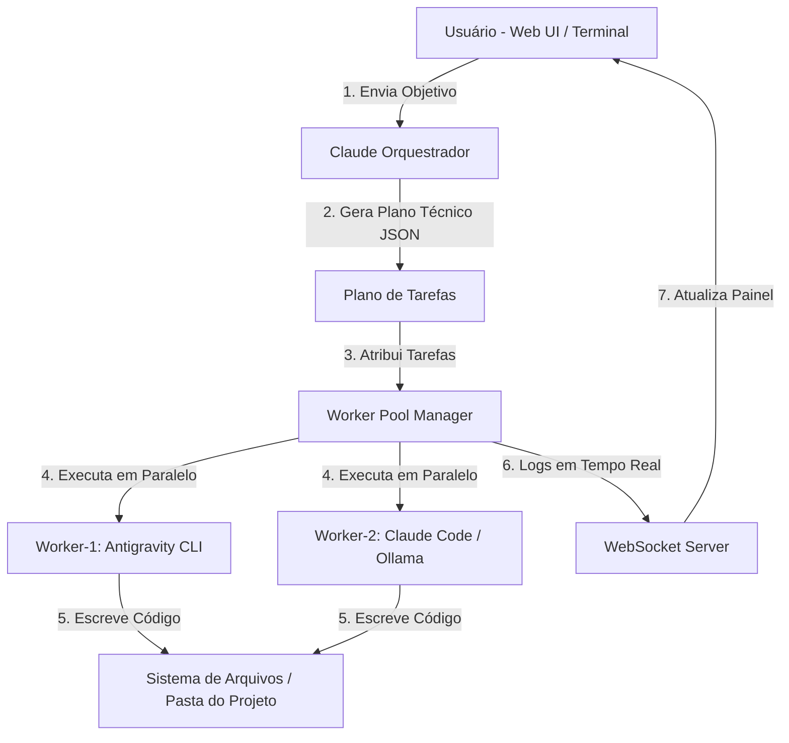

# 🪐 Singularity - Sistema Orquestrador IA Multi-Agente

> **Orquestrador de Inteligência Artificial Local e Autônomo**  
> Desenvolvido para transformar objetivos de alto nível em tarefas técnicas executadas em paralelo por operários de IA via CLI.

---

## 📌 Visão Geral

O **Singularity** é um sistema de orquestração multi-agente projetado para rodar localmente no seu computador. Ele permite criar, gerenciar e executar projetos complexos de software utilizando ferramentas CLI de IA (como `Antigravity CLI`, `Claude Code CLI`, `Ollama` e outros) de forma automatizada e sem dependência direta de APIs externas pagas por requisição.

O sistema é composto por:
1. **Claude Orquestrador (Chefe Central):** Analisa a demanda principal (Macro-Goal), decompõe o escopo em tarefas atômicas sequenciais ou paralelas em formato JSON e valida os resultados.
2. **Worker Pool (Operários Técnicos):** Agentes leitores/executores que recebem as tarefas do orquestrador e executam os comandos CLI no terminal da sua máquina em background.
3. **Painel Web (Web UI):** Interface moderna em Dark Mode / Glassmorphism com visualização em tempo real via WebSockets dos logs do terminal, status dos operários e progresso do plano.

---

## 🏗️ Arquitetura do Sistema



---

## ⚙️ Funcionalidades Principais

* **Orquestração Inteligente (3 Etapas):**
  * **Fase 1: Decomposição** — O Orquestrador analisa o objetivo e gera um plano atômico estruturado em JSON com grafo de dependências (`depends_on`).
  * **Fase 2: Execução Paralela** — Os operários livres assumem as tarefas sem dependências pendentes e executam os comandos CLI.
  * **Fase 3: Validação** — O Orquestrador analisa o resultado final e gera um parecer de qualidade.

* **Isolamento de Perfis de IA (Multi-Contas):**
  * Permite cadastrar múltiplos perfis de usuário do Antigravity (ex: `perfil_primario`, `perfil_secundario`).
  * O sistema altera as variáveis de ambiente (`USERPROFILE`, `HOME`, `LOCALAPPDATA`, `APPDATA`) por processo de operário, permitindo alternar de conta sem perder login.

* **Failover & Rotação Automática de Cotas:**
  * Detecta erros de limite de requisições (`Quota Exceeded`, `429`, `Rate Limit`).
  * Altera automaticamente o modelo (ex: de `Claude Sonnet 4.6` para `Gemini 3.1 Pro`) ou alterna para o próximo perfil de conta disponível.

* **Otimizações & Toggles Rápidos:**
  * **Modo Caveman (RTK):** Injeta instruções no prompt para respostas ultraconcisas e econômicas em tokens.
  * **Modo Non-Interactive (`--dangerously-skip-permissions -p`):** Executa comandos CLI sem solicitar confirmações manuais no terminal.

---

## 📁 Estrutura do Projeto

```
D:\Singularity - Sistema Orquestrador IA\
├── backend/
│   ├── main.py              # Servidor FastAPI & Endpoints WebSockets / REST
│   ├── orchestrator.py      # Motor do Claude Orquestrador (Decomposição & Validação)
│   ├── worker_pool.py       # Gerenciador de Operários (Execução em Threads + Subprocessos)
│   ├── ai_providers.py      # Registro expansível de Provedores de IA (agy, claude, ollama)
│   ├── config_manager.py    # Gerenciador de Configurações, Perfis e Persistência
│   └── prompt_templates.py  # Prompts do Orquestrador, Caveman e Validador
├── frontend/
│   ├── index.html           # Interface Web principal (Glassmorphism Dark Mode)
│   ├── css/style.css        # Design System em CSS Puro com variáveis HSL
│   └── js/app.js            # Cliente WebSocket, Renderizador de Plano e Logs
├── data/
│   ├── orchestrator_config.json # Configurações mantidas entre sessões
│   ├── current_plan.json        # Estado atual do plano de tarefas
│   └── chat_history.json        # Histórico de conversas do orquestrador
├── run.py                   # Script de inicialização do sistema
└── README.md                # Manual Técnico do Sistema
```

---

## 🛠️ Manual Técnico de Uso

### 1. Pré-requisitos
- **Python 3.10+** instalado no sistema.
- **Antigravity CLI (`agy`)** ou **Claude Code CLI (`claude`)** instalados e autenticados no terminal.
- Depedências Python do projeto (instaladas automaticamente pelo `run.py` ou via `pip install -r requirements.txt`).

### 2. Como Inicializar o Sistema

Abra o terminal na pasta do projeto e execute:
```powershell
cd "D:\Singularity - Sistema Orquestrador IA"
python run.py
```
O sistema irá:
1. Verificar e instalar dependências faltantes.
2. Iniciar o servidor FastAPI/Uvicorn em `http://127.0.0.1:8000`.
3. Abrir automaticamente a interface no seu navegador padrão.

---

### 3. Como Utilizar a Interface Web

1. **Enviar um Objetivo:**
   No painel central (Claude Orquestrador), digite o objetivo do seu projeto informando a pasta de destino (Exemplo: *Desenvolver um app Web Mobile na pasta "D:\MeuProjeto"*).
2. **Gerar o Plano:**
   Clique em **Enviar**. O Orquestrador analisará o pedido e exibirá o plano de tarefas divididas por complexidade no painel esquerdo.
3. **Executar com Operários:**
   Clique no botão **`🚀 Executar Plano com Operários`**.
4. **Acompanhar o Progresso:**
   - O grid de **Operários Técnicos** mostrará qual operário assumiu cada tarefa.
   - O **Console do Operário (Terminal ao Vivo)** exibirá as saídas de texto diretamente da execução dos comandos CLI em tempo real.

---

## 🔧 Solução de Problemas Técnicos (Troubleshooting)

| Sintoma | Causa | Solução Aplicada / Como Resolver |
| :--- | :--- | :--- |
| Operário travado no terminal | Execução interativa sem a flag `-p` | O sistema utiliza a flag `-p` no template do `ai_providers.py` para garantir execução não-interativa. |
| `NotImplementedError` no Windows | Conflito do `asyncio` EventLoop no Windows com Uvicorn | O sistema utiliza `subprocess.Popen` envelopado em `asyncio.to_thread` com threads dedicadas para leitura dos streams. |
| Erro de caracteres `UnicodeEncodeError` | Codificação padrão `CP1252` do terminal Windows | O ambiente dos subprocessos é forçado com `PYTHONIOENCODING=utf-8` e `PYTHONUTF8=1`. |

---

## 📜 Licença e Créditos
**Singularity - Sistema Orquestrador IA** — Desenvolvido para automação local e orquestração de múltiplos agentes de inteligência artificial.
